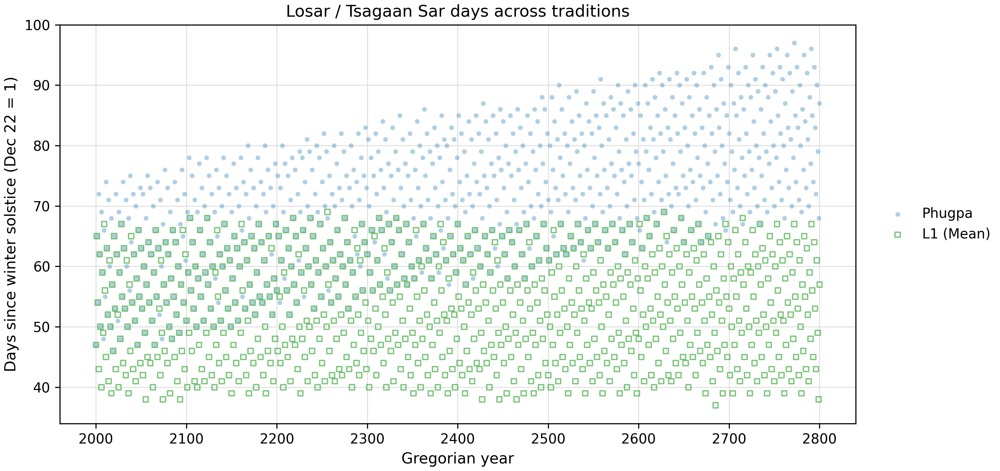
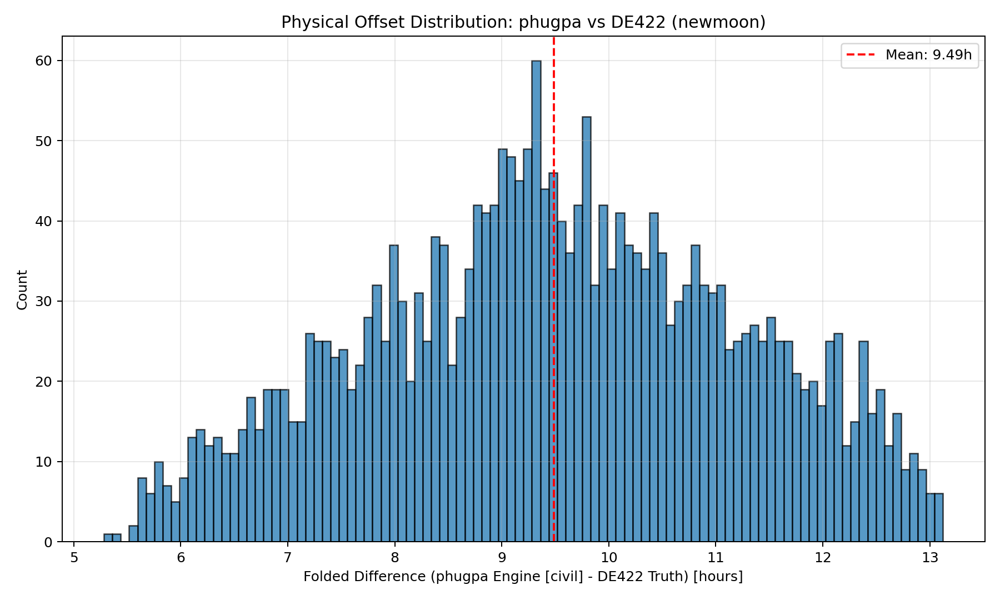
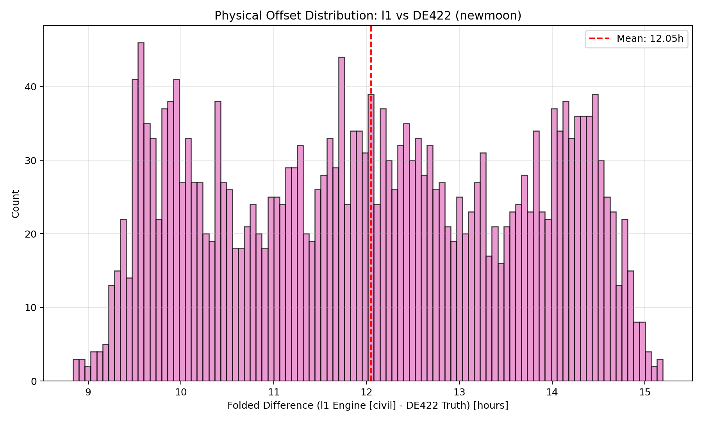
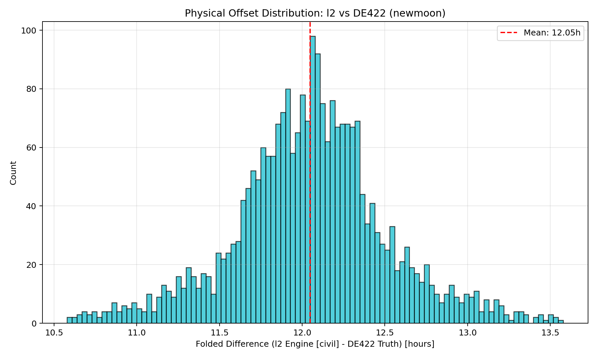
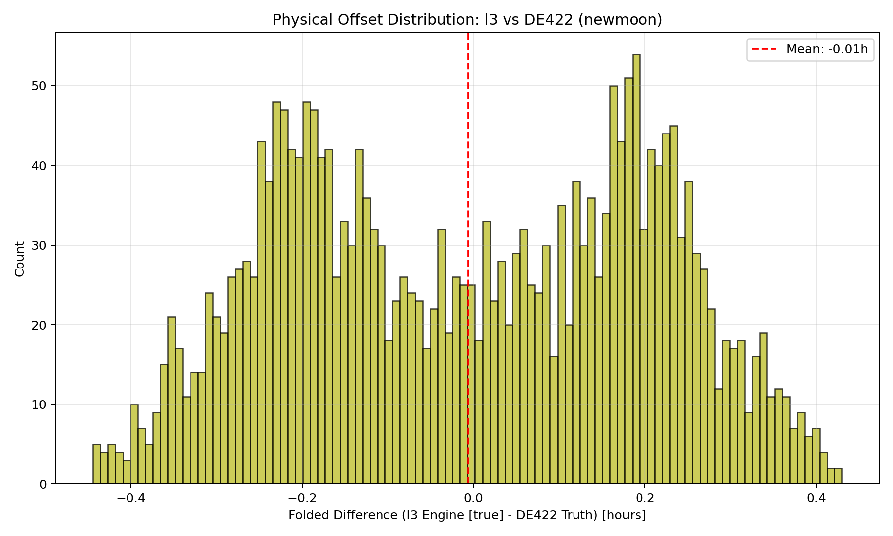

# The Modern Reforms

To correct the historical drifts, `caltib` proposes a spectrum of progressive reforms. A defining feature of all reform tiers is **geographical localization**. Unlike traditional models fixed to a single historical longitude, every reform engine dynamically accepts local coordinates (e.g., Lhasa, Ulaanbaatar, Montreal) to precisely calculate dawn and civil boundaries.

## The Progressive Reform Engines

The sequence advances from pure continuous rational fractions to strictly reproducible floating-point kinematics:

* **L0 (Pure Mean Baseline):** The foundational timeline. It is purely arithmetic without any anomalies, essentially extending the traditional Tibetan mean-month logic down to the daily level using precise modern rates.
* **L1 (Modernized Tradition):** Functionally similar to the traditional calendars (using primary anomalies and constant sunrise) but built with modernized, highly accurate epoch constants to correct baseline offsets.
* **L2 (Critical Anomalies):** Builds on L1 by introducing the most critical missing orbital anomalies: lunar evection and variation.
* **L3 (Spatial Sunrise):** Upgrades the model to 6 lunar terms and integrates rigorous spherical trigonometry to map true local sunrise across varying latitudes, replacing the constant sunrise assumption.
* **L4 & L5 (Analytical Float-Day):** These hybrid engines utilize L1-L3 style rational logic for their month models, but rely on strictly reproducible floating-point (FP) kinematics for their daily models. They feature 24 (L4) and 64 (L5) lunar terms and utilize high-precision FP-based spherical sunrise models.
* **L6 (Numerical Ephemeris):** The ultimate standard of astronomical truth. Connects directly to the JPL DE422 numerical integration to map syzygies using modern astrophysics.

---

## Visualizing the Improvements

Using our diagnostic laboratory, we can measure exactly how these architectural changes hit their target accuracies when compared against the JPL DE422 truth standard.

### 1. Stabilizing the New Year

As established in the traditional analysis, historical calendars drift by 2-3 days per century due to the 65/67 month ratio. The L1 reform replaces this ratio with a continuous mean-motion framework. As shown below, L1 (green squares) perfectly stabilizes the New Year, anchoring it cleanly within the proper seasonal window while the Phugpa tradition (blue dots) continues to drift away.

### 2. Correcting the Baseline Anchor (L1)

The traditional Phugpa calendar has a syzygy offset distribution with a ~3-hour standard deviation and a mean shift of roughly 9.5 hours from Greenwich noon. The L1 reform uses the same primary anomaly structure, so it retains a similar ~3-hour variance. However, its improved constants perfectly correct the anchor: the mean shift becomes exactly 12.05 hours. Because 12 hours past Greenwich noon is Greenwich midnight, adding Lhasa's +6 hour timezone offset means L1 targets a perfectly precise 6:00 AM local dawn.

**Tradition (Phugpa)**

**L1 Reform**

### 3. Collapsing the Variance (L2 & L3)

By upgrading the physics to the L2 engine—which simply adds the missing Evection and Variation anomalies—the massive 3-hour spread collapses. The L2 calendar achieves a highly accurate mean error of roughly 30 minutes.

Advancing to L3 introduces a 6-term lunar model and spherical sunrise. If plotted strictly by civil time, L3's variance appears slightly wider, but this is an illusion caused by the varying boundaries of actual seasonal sunrise. When measured by pure *true astronomical time*, the L3 engine tightens the accuracy even further, achieving a mean error of nearly 0 (less than 15 minutes).

