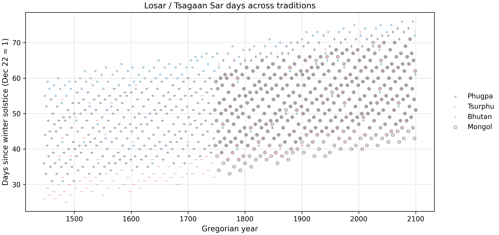
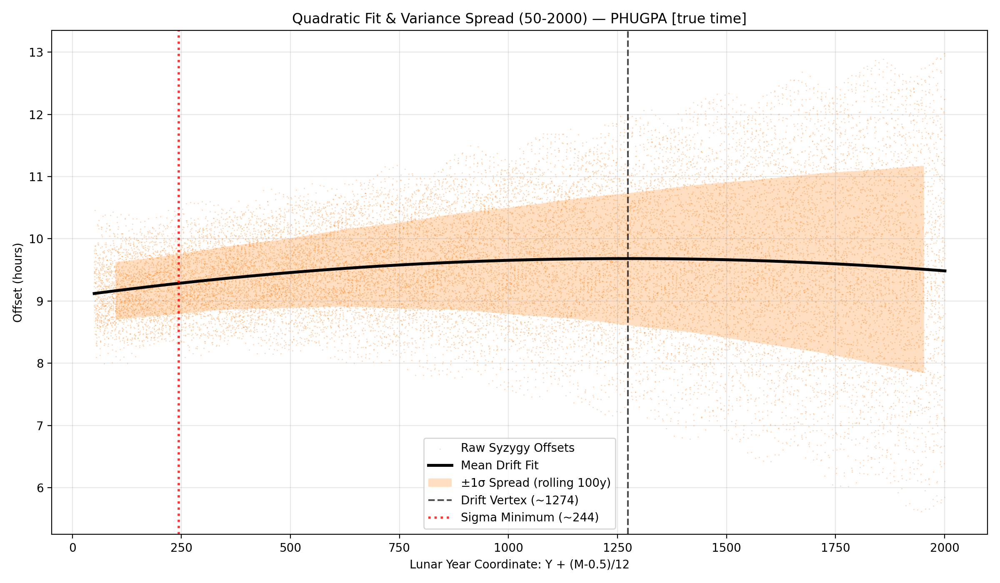
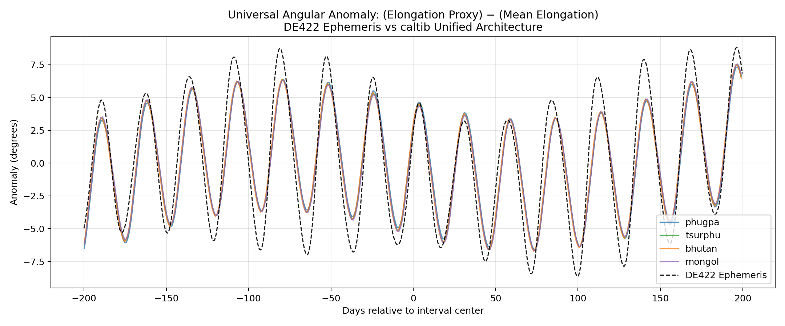
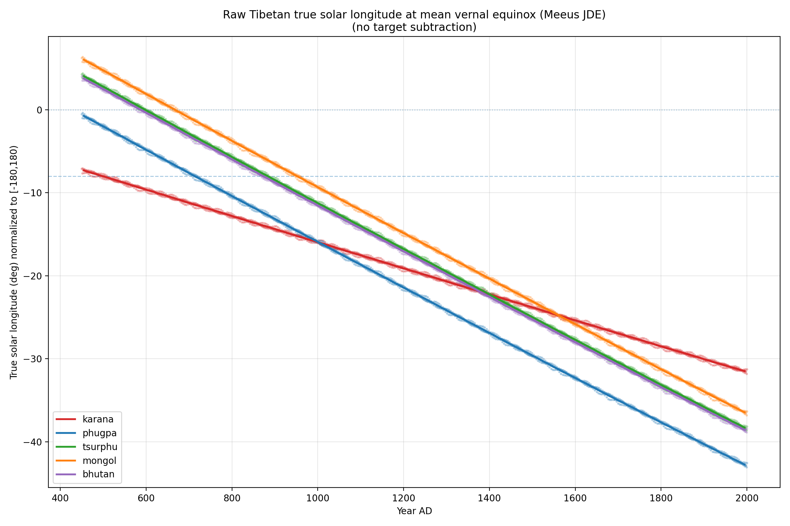

# The Traditional Tibetan Calendar

The family of Tibetan lunisolar calendars, formalizing principles found in the Kalacakra Tantra, provides an elegant and highly structured system for tracking time. However, analyzing these traditional algorithms through modern diagnostic tools reveals specific patterns of historical drift and variance.

---

## 1. The New Year Scatter and the 65/67 Rule

The scatter plot below visualizes the Gregorian dates on which the traditional Tibetan New Year (Losar / Tsagaan Sar) falls across several centuries. As you read the chart from left to right, you can observe the dates slowly trending in a distinct direction rather than remaining perfectly centered around a specific seasonal median.

**The Mathematics:** This persistent year-over-year drift—amounting to approximately 2 to 3 days per century—is fundamentally due to the calendar's core arithmetic axiom: the strict rule that exactly 67 lunar months equal 65 solar months. While this fractional relationship allows for predictable intercalation, it is an approximation that forces the calendar to slowly but inevitably drift relative to the actual tropical year.

---

## 2. Phase Drift and Exploding Variance

The next chart tracks the deviations (or offsets) between the calendar's calculated new moon times and the true astronomical syzygy over time. Looking at the data, two distinct visual phenomena emerge: first, the center of the deviation band sits slightly away from zero, and second, the overall vertical spread of the band noticeably widens as time progresses.

**Decoding the Baseline Shift:** The constant baseline shift in the deviations is explained by the historical epoch constants. To understand the numbers: our modern reference computation (JPL DE422) is based on Greenwich noon. The data shows a mean difference of roughly 9.5 hours. This means an astronomical event happening at 12:00 PM (noon) in Greenwich is recorded by the Tibetan calendar's internal clock as occurring at 9.5 hours past its own daily starting point.

Working backward, 12:00 PM minus 9.5 hours places the calendar's "internal 0-point" at 2:30 AM Greenwich time. In Lhasa's local time zone, 2:30 AM in Greenwich corresponds to exactly 8:30 AM. Since the Tibetan calendar day traditionally begins at dawn (closer to 6:00 AM), this 8:30 AM effective zero-point reveals that the calendar's mathematical moon is running about 2.5 hours "faster" than the real moon!

**The Exploding Variance:** Furthermore, an inherent vertical spread exists because Tibetan calendars only calculate the first (primary) anomaly of the moon. Figure 3 below, which is centered at February 1, 2026, perfectly illustrates these primary anomaly corrections.

By ignoring secondary lunar perturbations—such as Evection (a ~1.27° shift) and Variation (a ~0.66° shift)—the traditional calendar introduces a periodic, purely mathematical error of roughly 3 to 4 hours into every syzygy calculation. Finally, the gradual widening of the spread itself over the centuries is explained by the inaccurate values of the phase rates. As the calendar's anomaly cycles slowly fall out of phase with the actual moon, the variance is driven wider and wider.

---

## 3. Precession of the Equinoxes

This final chart plots the calendar's calculated solar longitude exactly at the moment of the true tropical Vernal Equinox. Over a timeline of 1,500 years, the plotted line reveals a steady, linear divergence from the expected zero-degree mark.

**The Mathematics:** Because traditional calendars use a sidereal framework (tracking the stars) rather than a tropical framework (tracking the Earth's axial tilt), the calendar inherently decouples from the human seasons over time. By analyzing this chart, we can observe specific intersection points and vertex values where the calendar historically aligned with the tropical equinox.

It is important to note that this error in solar longitude does not directly and immediately break the calendar's daily output (unlike the phase drifts in Parts 1 and 2). This is because the core mechanism for determining lunar days (tithis) relies on *elongation*—the difference between the Moon's longitude and the Sun's longitude. Since both bodies are calculated within the same drifting sidereal framework, their relative distance remains largely intact, masking the error. Nevertheless, this precessional drift means the calendar's internal mathematical framework slowly detaches from the true tropical seasons, remaining a deep, fundamental error at its root.